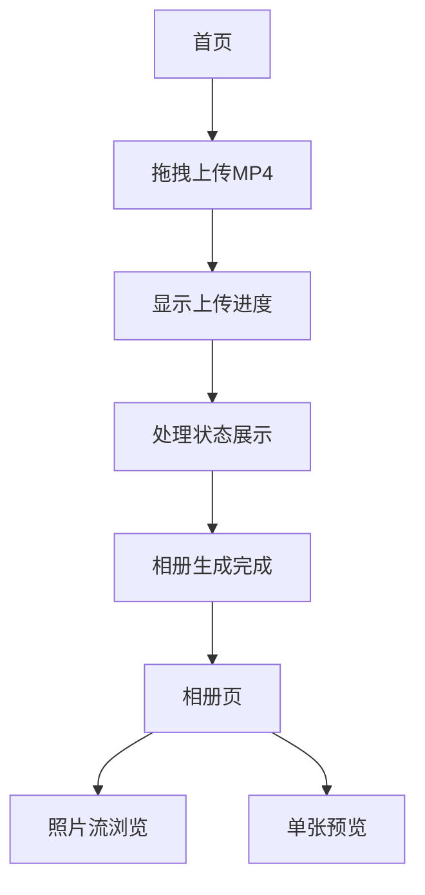

## 1. 产品概述
MP4转HEIC相册Web服务：用户拖拽上传MP4视频，系统自动提取每一帧并转换为HEIC格式，生成同名目录相册，以Google Photos照片流方式展示。利用Intel Arc A380硬件加速，兼顾处理速度与存储优化。

解决视频帧提取繁琐、存储空间占用大的问题，为摄影师、视频创作者提供便捷的视频转相册解决方案。

## 2. 核心功能

### 2.1 用户角色
| 角色 | 注册方式 | 核心权限 |
|------|----------|----------|
| 普通用户 | 无需注册，直接上传 | 上传MP4、查看相册、下载HEIC图片 |

### 2.2 功能模块
核心页面列表：
1. **首页**：拖拽上传区域、上传进度显示、处理状态展示
2. **相册页**：照片流展示、单张图片预览、相册信息展示

### 2.3 页面详情
| 页面名称 | 模块名称 | 功能描述 |
|----------|----------|----------|
| 首页 | 拖拽上传区 | 支持拖拽MP4文件或点击选择文件，实时显示文件名称和大小 |
| 首页 | 上传进度条 | 显示上传百分比、上传速度、剩余时间 |
| 首页 | 处理状态 | 分步骤显示：上传完成→开始处理→硬加速解码→HEIC编码→相册生成完成 |
| 相册页 | 照片流 | 按帧序号正序排列，瀑布流布局，支持滚动加载 |
| 相册页 | 图片预览 | 点击单张HEIC图片放大预览，支持左右切换浏览 |
| 相册页 | 相册信息 | 顶部显示相册名称（与MP4同名）、总帧数、分辨率信息 |

## 3. 核心流程
用户操作流程：
1. 用户访问首页 → 拖拽MP4文件到上传区域
2. 系统显示上传进度 → 上传完成后开始处理
3. 实时显示处理状态（帧提取进度）→ 处理完成后自动跳转到相册页
4. 浏览照片流 → 可点击单张图片预览 → 支持下载整个相册

## 4. 用户界面设计

### 4.1 设计风格
- **主色调**：深蓝色 (#1E3A8A) 搭配白色背景
- **按钮样式**：圆角矩形，悬停效果，主要操作为实心按钮
- **字体**：系统默认字体，标题18px，正文14px
- **布局风格**：卡片式布局，内容居中，最大宽度1200px
- **图标风格**：简洁线性图标，使用emoji或Font Awesome

### 4.2 页面设计概述
| 页面名称 | 模块名称 | UI元素 |
|----------|----------|----------|
| 首页 | 拖拽上传区 | 虚线边框大矩形区域，中央显示上传图标和提示文字，支持拖拽高亮效果 |
| 首页 | 进度展示 | 细进度条带百分比，下方显示具体状态文字，使用动画过渡效果 |
| 相册页 | 照片流 | Masonry瀑布流布局，图片间距8px，懒加载实现，加载时显示骨架屏 |
| 相册页 | 图片预览 | 黑色半透明遮罩层，图片居中显示，左右箭头切换，ESC键关闭 |

### 4.3 响应式设计
桌面优先设计，适配移动端：
- 桌面端：拖拽上传区尺寸600x400px，照片流4列布局
- 平板端：拖拽上传区尺寸500x300px，照片流3列布局  
- 手机端：拖拽上传区全宽，照片流2列布局

### 4.4 性能要求
- 首屏加载时间 ≤ 3秒
- 照片流滚动加载时间 ≤ 1秒
- 单张HEIC预览加载时间 ≤ 2秒
- 支持并发5个任务处理

## 5. 技术约束
- 仅支持MP4格式输入，优先H264编码
- 输出HEIC格式，质量默认80，比PNG节省70-85%存储
- 需要Intel Arc A380显卡支持硬件加速
- 兼容Chrome 118+、Edge 118+浏览器
- 单文件大小限制 configurable，建议默认2GB