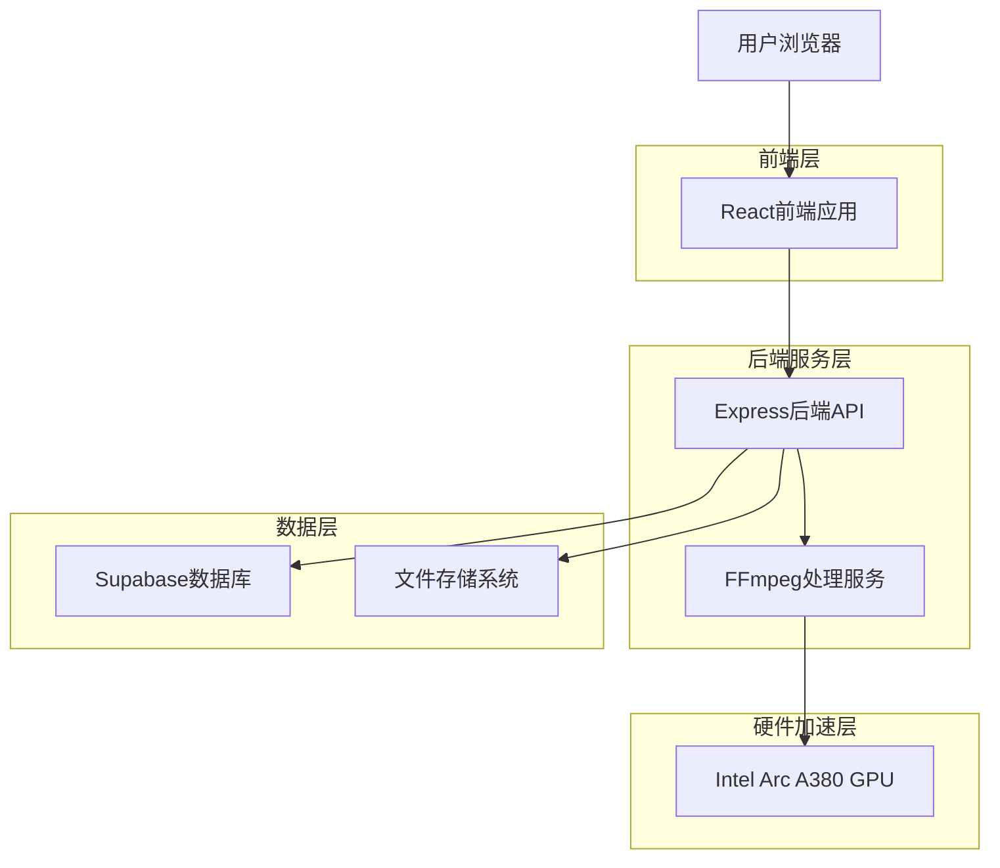
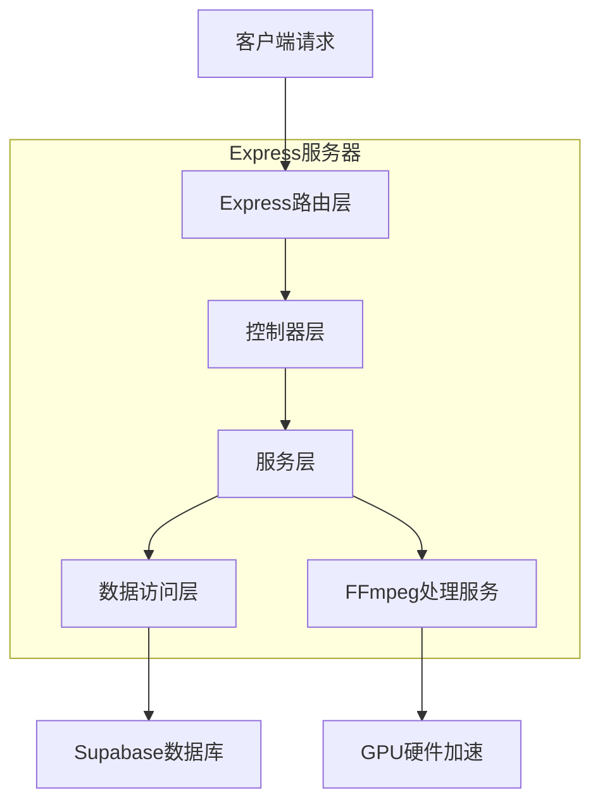
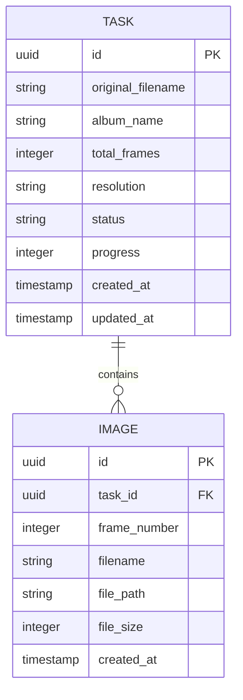

## 1. 架构设计



## 2. 技术栈描述

- **前端**: React@18 + TypeScript + TailwindCSS@3 + Vite
- **初始化工具**: vite-init
- **后端**: Express@4 + TypeScript + Multer文件上传
- **数据库**: Supabase (PostgreSQL)
- **文件存储**: 本地文件系统（可扩展至MinIO）
- **视频处理**: FFmpeg@6.0（启用QSV和libheif支持）

## 3. 路由定义

| 路由 | 用途 |
|------|------|
| / | 首页，拖拽上传界面 |
| /album/:albumId | 相册展示页面，照片流浏览 |
| /api/upload | 文件上传API |
| /api/progress/:taskId | 查询处理进度API |
| /api/album/:albumId | 获取相册信息和图片列表API |
| /api/download/:albumId | 下载整个相册API |

## 4. API定义

### 4.1 文件上传API
```
POST /api/upload
```

请求（multipart/form-data）:
| 参数名 | 参数类型 | 是否必需 | 描述 |
|--------|----------|----------|------|
| file | File | 是 | MP4视频文件 |

响应:
| 参数名 | 参数类型 | 描述 |
|--------|----------|------|
| taskId | string | 任务唯一标识 |
| status | string | 上传状态 |
| message | string | 状态描述 |

示例:
```json
{
  "taskId": "550e8400-e29b-41d4-a716-446655440000",
  "status": "uploaded",
  "message": "文件上传成功"
}
```

### 4.2 查询处理进度API
```
GET /api/progress/:taskId
```

响应:
| 参数名 | 参数类型 | 描述 |
|--------|----------|------|
| taskId | string | 任务ID |
| status | string | 当前状态 |
| progress | number | 处理进度百分比 |
| currentFrame | number | 当前处理帧数 |
| totalFrames | number | 总帧数 |
| estimatedTime | number | 预估剩余时间（秒） |

示例:
```json
{
  "taskId": "550e8400-e29b-41d4-a716-446655440000",
  "status": "processing",
  "progress": 65,
  "currentFrame": 1300,
  "totalFrames": 2000,
  "estimatedTime": 45
}
```

### 4.3 获取相册信息API
```
GET /api/album/:albumId
```

响应:
| 参数名 | 参数类型 | 描述 |
|--------|----------|------|
| albumId | string | 相册ID |
| name | string | 相册名称 |
| totalFrames | number | 总帧数 |
| resolution | string | 分辨率 |
| createdAt | string | 创建时间 |
| images | array | 图片列表 |

## 5. 服务器架构图



## 6. 数据模型

### 6.1 数据模型定义


### 6.2 数据定义语言

任务表 (tasks)
```sql
-- 创建任务表
CREATE TABLE tasks (
    id UUID PRIMARY KEY DEFAULT gen_random_uuid(),
    original_filename VARCHAR(255) NOT NULL,
    album_name VARCHAR(255) NOT NULL,
    total_frames INTEGER DEFAULT 0,
    resolution VARCHAR(20),
    status VARCHAR(20) DEFAULT 'pending' CHECK (status IN ('pending', 'processing', 'completed', 'failed')),
    progress INTEGER DEFAULT 0 CHECK (progress >= 0 AND progress <= 100),
    created_at TIMESTAMP WITH TIME ZONE DEFAULT NOW(),
    updated_at TIMESTAMP WITH TIME ZONE DEFAULT NOW()
);

-- 创建索引
CREATE INDEX idx_tasks_status ON tasks(status);
CREATE INDEX idx_tasks_created_at ON tasks(created_at DESC);
```

图片表 (images)
```sql
-- 创建图片表
CREATE TABLE images (
    id UUID PRIMARY KEY DEFAULT gen_random_uuid(),
    task_id UUID REFERENCES tasks(id) ON DELETE CASCADE,
    frame_number INTEGER NOT NULL,
    filename VARCHAR(255) NOT NULL,
    file_path VARCHAR(500) NOT NULL,
    file_size INTEGER,
    created_at TIMESTAMP WITH TIME ZONE DEFAULT NOW()
);

-- 创建索引
CREATE INDEX idx_images_task_id ON images(task_id);
CREATE INDEX idx_images_frame_number ON images(frame_number);
```

### 6.3 Supabase权限配置
```sql
-- 授予基本读取权限给匿名用户
GRANT SELECT ON tasks TO anon;
GRANT SELECT ON images TO anon;

-- 授予完全权限给认证用户
GRANT ALL PRIVILEGES ON tasks TO authenticated;
GRANT ALL PRIVILEGES ON images TO authenticated;
```

## 7. 部署配置

### 7.1 Docker Compose配置
```yaml
version: '3.8'
services:
  app:
    build: .
    ports:
      - "3000:3000"
    environment:
      - NODE_ENV=production
      - SUPABASE_URL=${SUPABASE_URL}
      - SUPABASE_ANON_KEY=${SUPABASE_ANON_KEY}
    volumes:
      - ./uploads:/app/uploads
      - ./albums:/app/albums
    depends_on:
      - ffmpeg
      
  ffmpeg:
    image: jrottenberg/ffmpeg:6.0-ubuntu
    volumes:
      - ./uploads:/uploads
      - ./albums:/albums
    command: tail -f /dev/null
```

### 7.2 环境要求
- Node.js 18+
- FFmpeg 6.0+（需编译支持QSV和libheif）
- Intel Arc A380驱动（4250+版本）
- 8GB+ RAM，50GB+ 存储空间