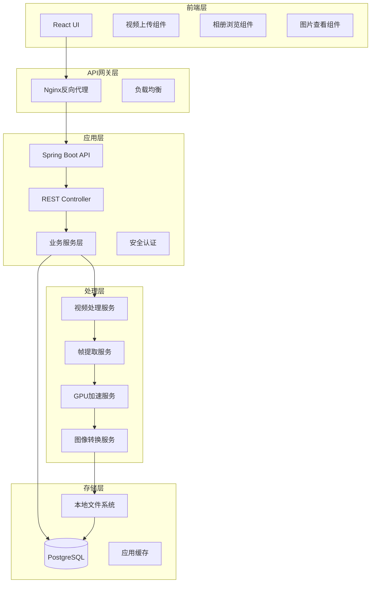
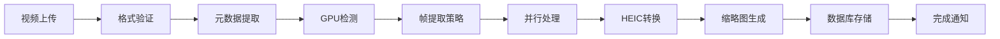

# 系统架构设计

## 整体架构



## 技术栈详细设计

### 后端技术栈
- **运行时**: Java 21 + GraalVM Native Image
- **框架**: Spring Boot 4
- **数据访问**: Spring Data JPA + Hibernate
- **数据库**: PostgreSQL 16+
- **安全**: Spring Security 6
- **文档**: SpringDoc OpenAPI 3
- **测试**: JUnit 5 + TestContainers
- **构建工具**: Maven
- **图像处理**: OpenCV + FFmpeg

### 前端技术栈
- **框架**: React 18+ with TypeScript
- **状态管理**: Zustand
- **UI组件**: Ant Design / Material-UI
- **路由**: React Router v6
- **HTTP客户端**: Axios
- **图像处理**: Canvas API
- **拖拽上传**: react-dropzone
- **图像查看**: react-photo-view

### GPU加速支持
```java
public interface GPUAccelerationService {
    ProcessingResult processWithGPU(VideoProcessingRequest request);
    boolean isGPUSupported();
    GPUType getAvailableGPUType();
}

enum GPUType {
    INTEL_ARC_OPENVINO,
    NVIDIA_CUDA,
    AMD_VULKAN,
    CPU_FALLBACK
}
```

### 处理管道设计



## 核心服务设计

### 1. 视频处理服务 (VideoProcessingService)
```java
@Service
public class VideoProcessingService {

    @Async
    public CompletableFuture<ProcessingResult> processVideo(Long albumId);

    private void extractFrames(Album album, GPUType gpuType);

    private void convertToHEIC(List<File> frameFiles);

    private void generateThumbnails(List<File> heicFiles);

    private void saveMetadata(List<Frame> frames);
}
```

### 2. GPU加速服务 (GPUAccelerationService)
```java
@Service
public class GPUAccelerationServiceImpl implements GPUAccelerationService {

    private final Map<GPUType, GPUPipeline> gpuPipelines;

    @Override
    public ProcessingResult processWithGPU(VideoProcessingRequest request) {
        GPUType gpuType = detectOptimalGPU();
        return gpuPipelines.get(gpuType).process(request);
    }

    private GPUType detectOptimalGPU() {
        // Intel Arc OpenVINO > NVIDIA CUDA > AMD Vulkan > CPU
    }
}
```

### 3. 存储服务 (StorageService)
```java
@Service
public class StorageService {

    public String storeVideo(MultipartFile videoFile);

    public String storeFrame(Long albumId, Integer frameNumber, BufferedImage image);

    public String storeThumbnail(Long albumId, Integer frameNumber, BufferedImage thumbnail);

    public InputStream loadFrame(String path);

    public void deleteAlbum(Long albumId);
}
```

## 数据库连接配置

### application.yml
```yaml
spring:
  datasource:
    url: jdbc:postgresql://localhost:5432/video_frame_catcher
    username: ${DB_USERNAME:vfc_user}
    password: ${DB_PASSWORD:vfc_password}
    driver-class-name: org.postgresql.Driver
    hikari:
      maximum-pool-size: 20
      minimum-idle: 5
      connection-timeout: 30000

  jpa:
    hibernate:
      ddl-auto: validate
    show-sql: false
    properties:
      hibernate:
        dialect: org.hibernate.dialect.PostgreSQLDialect
        jdbc:
          batch_size: 50
        order_inserts: true
```

## FFmpeg集成设计

### FFmpeg服务配置
```java
@Component
public class FFmpegService {

    @Value("${ffmpeg.path}")
    private String ffmpegPath;

    public VideoMetadata extractMetadata(String videoPath);

    public List<String> extractFrames(String videoPath, String outputPattern);

    public boolean convertToHEIC(String inputPath, String outputPath);
}
```

## 性能优化策略

### 1. 数据库优化
- 使用JPA批处理操作
- 合理的索引设计
- 连接池配置
- 读写分离（未来扩展）

### 2. 文件存储优化
- HEIC格式压缩（节省50-70%空间）
- 多级缩略图
- CDN集成（未来扩展）

### 3. 处理性能优化
- GPU并行处理
- 帧采样策略（可配置帧率）
- 内存管理优化
- 异步处理队列

### 4. 前端性能优化
- 虚拟滚动（大量图片）
- 图片懒加载
- WebP格式支持
- Service Worker缓存

## 安全设计

### 1. 文件安全
- 文件类型验证
- 文件大小限制
- 路径遍历防护
- 病毒扫描集成

### 2. API安全
- JWT认证
- CORS配置
- 请求限流
- SQL注入防护

### 3. 数据安全
- 敏感数据加密
- 数据库连接加密
- 定期备份策略

## 监控和日志

### 1. 应用监控
- Spring Boot Actuator
- Micrometer + Prometheus
- 自定义健康检查

### 2. 性能监控
- GPU使用率监控
- 处理时间统计
- 存储空间监控

### 3. 日志管理
- 结构化日志
- 日志级别管理
- 错误追踪